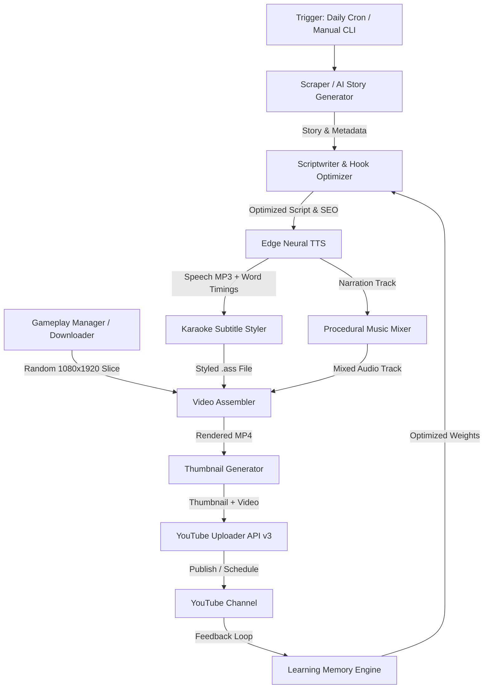

# 🎬 AutoPost

> **Fully Autonomous AI YouTube Automation & Channel Growth Pipeline**  
> Hands-free viral video generation, voice synthesis, subtitle rendering, gameplay background splicing, and automated YouTube publishing powered by **Google Gemini** and **GitHub Actions**.

[](https://www.python.org/)
[](LICENSE)
[](.github/workflows/)
[](https://aistudio.google.com/)
[](https://github.com/rany2/edge-tts)
[](https://ffmpeg.org/)

---

## ⚡ Highlights

- **🧠 Autonomous Story Sourcing & AI Fallback**: Scrapes top stories from Reddit (`r/AmItheAsshole`, `r/ProRevenge`, `r/nosleep`, `r/entitledparents`) and features a **100% resilient Gemini AI story generator** that creates viral scripts with zero external API dependencies.
- **🎙️ Neural Multi-Language Narration**: Natural, human-like voice synthesis in **English** and **Hindi** powered by Microsoft Edge Neural TTS with precise sentence pacing.
- **🎮 Autonomous Background Gameplay Downloader**: Automatically downloads and manages copyright-free 1080x1920 vertical background videos (e.g. Minecraft Parkour), slicing random segments for every video.
- **💬 Animated Karaoke Subtitles**: Renders word-by-word highlighted subtitles in `.ass` format with dynamic scaling, custom fonts, and high-retention color contrast.
- **🎵 Procedural Audio Mixing & Ducking**: Automatically ducks ambient music tracks behind voice narration with soft fades and procedural audio generation.
- **🖼️ High-CTR Thumbnail Generation**: Creates click-worthy thumbnails with niche-specific palettes, high-contrast badges, and dynamic text overlays.
- **🧬 Strategic Evolution & Learning Memory**: Tracks winning hooks, pacing, click-through rates, and retention in `data/learning_memory.json`, dynamically refining future generation parameters.
- **🚀 YouTube Data API v3 Automation**: Complete headless OAuth 2.0 authentication, metadata tagging, privacy selection (`public`, `unlisted`, `private`), and scheduled publishing.
- **☁️ 100% Turnkey GitHub Actions**: Pre-configured daily cron workflows to build and publish English and Hindi Shorts daily without hosting your own server.

---

## 🏗️ Architecture & Workflow



---

## 📁 Repository Structure

```text
autopost/
├── .github/
│   ├── ISSUE_TEMPLATE/           # Bug report & feature request templates
│   └── workflows/
│       ├── daily-english.yml     # Automated daily English Shorts schedule
│       ├── daily-hindi.yml       # Automated daily Hindi Shorts schedule
│       └── test-pipeline.yml     # Modular workflow for testing stages
├── assets/                       # Asset directories (ignored by git, populated automatically)
│   ├── audio/                    # Ambient background music tracks
│   ├── fonts/                    # Custom TTF/OTF subtitle fonts
│   ├── gameplay/                 # 1080x1920 vertical background footage
│   └── images/                   # Static overlays and icons
├── data/
│   ├── learning_memory.json      # Evolutionary memory tracking winning hooks & pacing
│   ├── used_stories.json         # Cache of processed stories to prevent duplicate uploads
│   └── upload_log.json           # Log of published videos and URLs
├── output/                       # Generated artifacts (MP4 videos, audio, thumbnails)
├── src/
│   ├── audio/                    # TTS engine, audio merging, and music mixing
│   ├── evolution/                # Learning memory and strategy optimization
│   ├── scraper/                  # Reddit client, AI story generator, and story selection
│   ├── scriptwriter/             # Script rewriter, dialogue splitter, SEO, and translation
│   ├── thumbnail/                # Thumbnail generator with dynamic text & badges
│   ├── uploader/                 # YouTube OAuth client, token authorizer, and uploader
│   ├── video/                    # Video assembler, subtitle styler, and gameplay manager
│   ├── config.py                 # Central configuration and environment loader
│   ├── pipeline.py               # Master orchestration CLI
│   └── utils.py                  # Common utilities and FFmpeg helpers
├── .env.example                  # Template for required environment variables
├── .gitignore                    # Rigorous rules preventing credential or media leaks
├── requirements.txt              # Python project dependencies
├── CONTRIBUTING.md               # Guidelines for contributing
├── SECURITY.md                   # Security and credential protection policy
└── README.md
```

---

## 🚀 Quickstart

### 1. Prerequisites
- **Python 3.10+**
- **FFmpeg**: Must be installed and accessible in your system `PATH` (with `libass` support).
  - **Windows**: `winget install Gyan.FFmpeg` or `choco install ffmpeg`
  - **Ubuntu/Debian**: `sudo apt update && sudo apt install -y ffmpeg`
  - **macOS**: `brew install ffmpeg`

### 2. Installation

```bash
# Clone the repository
git clone https://github.com/sagardawadi16-web/autopost.git
cd autopost

# Create and activate a virtual environment
python -m venv .venv
source .venv/bin/activate       # Linux/macOS
# or: .venv\Scripts\activate    # Windows PowerShell

# Install dependencies
pip install -r requirements.txt
```

### 3. Environment Configuration

Copy the example environment configuration:

```bash
cp .env.example .env            # Linux/macOS
copy .env.example .env          # Windows
```

Edit `.env` and fill in your keys:

```env
# Required for AI generation, script rewriting, and SEO
GEMINI_API_KEY=your_gemini_api_key_here

# Required for YouTube uploads (Google Cloud Console OAuth 2.0 Desktop Client)
YOUTUBE_CLIENT_ID=your_client_id_here
YOUTUBE_CLIENT_SECRET=your_client_secret_here

# Channel refresh tokens (generated via the built-in CLI below)
YT_EN_REFRESH_TOKEN=your_english_refresh_token_here
YT_HI_REFRESH_TOKEN=your_hindi_refresh_token_here
```

> [!IMPORTANT]
> Never commit your `.env` file to version control. It is ignored by `.gitignore` by default.

---

## 🔑 One-Time YouTube OAuth Setup

AutoPost includes a built-in interactive authorizer to obtain long-lived refresh tokens:

1. In the [Google Cloud Console](https://console.cloud.google.com/):
   - Create a project.
   - Enable the **YouTube Data API v3**.
   - Configure the **OAuth Consent Screen** (set publishing status to *In-production* or add your email as a test user).
   - Go to **Credentials** -> **Create Credentials** -> **OAuth Client ID** -> Application Type: **Desktop app**.
   - Copy the Client ID and Client Secret into your `.env` file.
2. Run the interactive authorizer:
   ```bash
   python -m src.pipeline --authorize --channel english
   ```
3. A browser window will open (or copy the displayed link). Sign in with your YouTube channel account and grant permission.
4. The terminal will output your refresh token. Copy it into `.env` (or into your GitHub Repository Secrets).
5. Repeat for `--channel hindi` if managing a bilingual channel.

---

## 💻 CLI Usage

### Run Full Autonomous Production
```bash
# Generate and upload an English Short (published publicly by default)
python -m src.pipeline --channel english --format shorts

# Generate and upload a Hindi Short (published publicly by default)
python -m src.pipeline --channel hindi --format shorts

# Optional: Upload with custom visibility ('public', 'unlisted', or 'private')
python -m src.pipeline --channel english --privacy public
python -m src.pipeline --channel english --privacy unlisted
```

### Dry-Run Simulation (No YouTube Upload)
Test the entire pipeline locally without publishing:
```bash
python -m src.pipeline --channel english --dry-run
```
*Generated videos and thumbnails will be saved in `output/video/` and `output/thumbnails/`.*

### Test Individual Pipeline Stages
```bash
# Test story fetching & AI generation
python -m src.pipeline --channel english --stage scrape

# Test scriptwriting & SEO optimization
python -m src.pipeline --channel english --stage script

# Test voice synthesis & ambient audio mixing
python -m src.pipeline --channel english --stage audio

# Test video rendering & subtitle styling
python -m src.pipeline --channel english --stage video

# Test thumbnail generation
python -m src.pipeline --channel english --stage thumbnail
```

### Strategic Learning Report
Inspect channel growth patterns, retention observations, and winning hook rules:
```bash
python -m src.pipeline --report
```

---

## ☁️ 24/7 Cloud Automation (GitHub Actions)

AutoPost comes with pre-configured GitHub Actions workflows for continuous daily publishing with zero infrastructure costs.

### Setting Up GitHub Secrets
Go to your GitHub repository -> **Settings** -> **Secrets and variables** -> **Actions** -> **New repository secret**, and add:

| Secret Name | Description |
| ----------- | ----------- |
| `GEMINI_API_KEY` | Google Gemini API key |
| `YT_CLIENT_ID` | Google OAuth Client ID |
| `YT_CLIENT_SECRET` | Google OAuth Client Secret |
| `YT_EN_REFRESH_TOKEN` | Refresh token for English channel |
| `YT_HI_REFRESH_TOKEN` | Refresh token for Hindi channel |
| `REDDIT_CLIENT_ID` | *(Optional)* Reddit API Client ID |
| `REDDIT_CLIENT_SECRET` | *(Optional)* Reddit API Client Secret |

### Workflows Included:
- **Daily English Short** (`.github/workflows/daily-english.yml`): Runs daily at 11:30 UTC.
- **Daily Hindi Short** (`.github/workflows/daily-hindi.yml`): Runs daily at 13:00 UTC.
- **Test Pipeline** (`.github/workflows/test-pipeline.yml`): Manual dispatch with selectable channel and stage.

All workflows upload generated video artifacts to GitHub Actions for 14 days and automatically commit updated learning memory back to the repository.

---

## 🔒 Security & Privacy

We treat security and credential safety as top priorities:
- **No Hardcoded Credentials**: All secrets are retrieved via environment variables.
- **Zero-Commit Policy**: `.gitignore` strictly excludes `.env`, `secrets.json`, `client_secret*.json`, `*.pem`, `*.key`, and temporary video/audio files.
- **Safe Fallbacks**: When YouTube credentials are not present, the pipeline defaults to simulation mode (`--dry-run`) and retains rendered assets locally.

For vulnerability reports and security best practices, see [SECURITY.md](SECURITY.md).

---

## 🤝 Contributing

Contributions, bug reports, and suggestions are welcome! Please check [CONTRIBUTING.md](CONTRIBUTING.md) for details on code style, testing, and pull requests.

---

## 📄 License

This project is licensed under the [MIT License](LICENSE).
