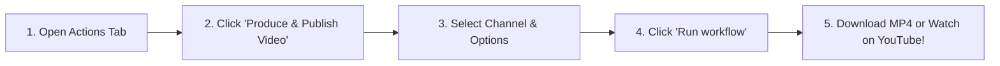
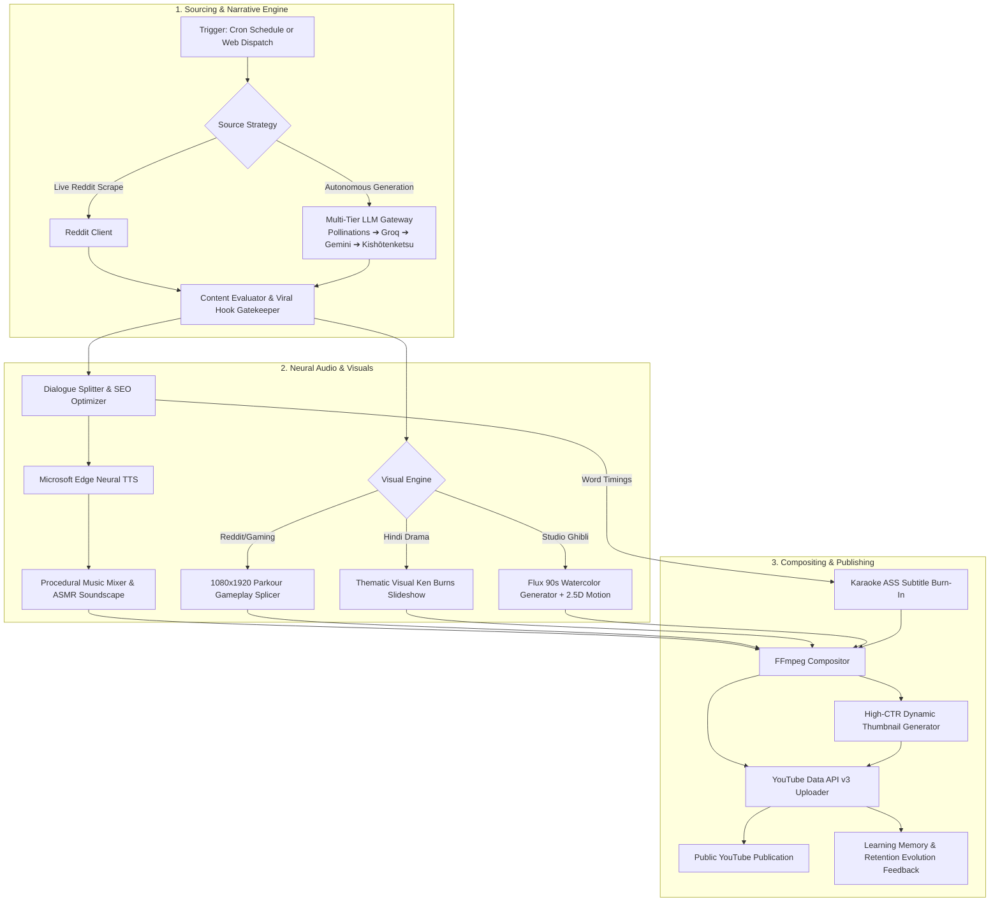

# 🎬 AutoPost: Autonomous AI YouTube Studio

> **Turnkey AI Video Studio & Autonomous Channel Growth Engine**  
> Creates, narrates, animates, subtitles, and publishes viral YouTube Shorts & Long-Form videos automatically using **Google Gemini**, **Microsoft Neural TTS**, **Flux/SDXL**, and **GitHub Actions**.

[](https://github.com/sagardawadi16-web/autopost/actions/workflows/generate-video.yml)
[](https://github.com/sagardawadi16-web/autopost/actions/workflows/daily-english.yml)
[](https://github.com/sagardawadi16-web/autopost/actions/workflows/daily-hindi.yml)
[](https://github.com/sagardawadi16-web/autopost/actions/workflows/daily-ghibli.yml)
[](https://www.python.org/)
[](LICENSE)
[](https://aistudio.google.com/)

---

## 🌟 Choose How You Want to Run AutoPost

| Method | Setup Time | What You Need | Best For |
| :--- | :--- | :--- | :--- |
| **☁️ GitHub Actions (Recommended)** | **2 minutes** | Just a browser! (No Python or FFmpeg install) | Running 24/7 in the cloud, daily automated posting, or 1-click video creation. |
| **💻 Local Terminal (CLI)** | **5 minutes** | Python 3.12 & FFmpeg installed locally | Local development, rapid iteration, testing new video styles. |

---

## 🚀 1-Click Run on GitHub (Zero Local Installation)

You can generate and download or publish videos directly from the GitHub web UI in 60 seconds:



1. Navigate to the **[Actions Tab](https://github.com/sagardawadi16-web/autopost/actions)** of this repository.
2. In the left sidebar, click **[🎬 Produce & Publish Video (One-Click)](https://github.com/sagardawadi16-web/autopost/actions/workflows/generate-video.yml)**.
3. Click the **Run workflow** dropdown on the right side.
4. Customize your video:
   - **Target Channel**: Select `english`, `hindi`, `ghibli`, or `comparison`.
   - **Format**: Select `shorts` (9:16 vertical) or `longform` (16:9 landscape).
   - **Action Mode**:
     - `publish`: Renders video and uploads directly to your YouTube channel.
     - `preview`: Renders video **without uploading**; allows you to download the `.mp4` and `.jpg` artifacts directly from GitHub!
   - **YouTube Visibility**: `public` *(default)*, `unlisted`, or `private`.
   - **Custom Topic / Theme**: *(Optional)* Enter any prompt (e.g., *"Monsoon rain evening in 90s village"* or *"Sister tried to extort wedding venue"*).
5. Click **Run workflow** (green button).
6. Once finished (2–3 minutes), click into the run to view the **Rich Summary Card** with your YouTube link and download your finished video under **Artifacts**!

---

## 🎨 Supported Video Styles & Channels

AutoPost powers multiple distinct content channels out-of-the-box:

| Channel Style | Visual Aesthetic | Audio & Narration | Target Format |
| :--- | :--- | :--- | :--- |
| **📺 English Reddit Stories** | Spliced 1080x1920 Minecraft Parkour gameplay footage | Multi-speaker neural English voiceover (`GuyNeural`, `JennyNeural`) + Word-by-word karaoke ASS subtitles | Shorts (9:16) & Longform (16:9) |
| **🇮🇳 Hindi Kahaniya & Drama** | Dynamic Ken Burns thematic visual slideshow + atmospheric lighting | Rich Hindi neural narration (`MadhurNeural`, `SwaraNeural`) + procedural ambient soundtrack | Shorts (9:16) & Multi-Part Series |
| **🍃 @GHIBLISTYLESTUDIO** | 90s Indian village nostalgia, watercolor gouache anime scenes (Flux/SDXL) + slow 2.5D camera pans | Layered ASMR soundscape (tin roof rain, chulha crackling, chai bubbling) + soft calming Swara narration | Shorts (9:16) & Landscape Stories |
| **⚡ Comparison Shorts** | Split-screen comparative edits (*"Normal Save VS Genuine Love"*) | Energetic hooks + synchronized transition sfx | Shorts (9:16) |

---

## 🔑 2-Minute GitHub Secrets Setup

To enable automated publishing and cloud execution, add the following secrets in **Settings** -> **Secrets and variables** -> **Actions** -> **New repository secret**:

| Secret Name | Required? | Description | Where to Get It |
| :--- | :---: | :--- | :--- |
| `GEMINI_API_KEY` | **Recommended** | Powers autonomous viral scriptwriting & SEO | Free at [Google AI Studio](https://aistudio.google.com/app/apikey) *(Falls back to keyless Pollinations if absent)* |
| `YT_CLIENT_ID` | **For Uploads** | Google Cloud OAuth Client ID | [Google Cloud Console](https://console.cloud.google.com/) (Desktop app credential) |
| `YT_CLIENT_SECRET` | **For Uploads** | Google Cloud OAuth Client Secret | [Google Cloud Console](https://console.cloud.google.com/) |
| `YT_EN_REFRESH_TOKEN` | Optional | Refresh token for English YouTube channel | Generated via `python -m src.pipeline --authorize --channel english` |
| `YT_HI_REFRESH_TOKEN` | Optional | Refresh token for Hindi YouTube channel | Generated via `python -m src.pipeline --authorize --channel hindi` |
| `YT_GHIBLI_REFRESH_TOKEN`| Optional | Refresh token for Ghibli YouTube channel | Generated via `python -m src.uploader.authorize_channel --channel ghibli` |

> [!TIP]
> **No YouTube credentials yet?** No problem! AutoPost automatically detects missing credentials and gracefully runs in **Preview Mode**, generating complete high-definition `.mp4` video files that you can preview and download directly from the GitHub Actions run page.

---

## 🏗️ Autonomous Architecture



---

## 💻 Local CLI Quickstart

If you prefer running or developing on your local machine:

### 1. Prerequisites
- **Python 3.10+** (Python 3.12 recommended)
- **FFmpeg** in your system `PATH`:
  - **Windows**: `winget install Gyan.FFmpeg`
  - **macOS**: `brew install ffmpeg`
  - **Ubuntu/Debian**: `sudo apt update && sudo apt install -y ffmpeg`

### 2. Setup
```bash
# Clone repository
git clone https://github.com/sagardawadi16-web/autopost.git
cd autopost

# Create and activate virtual environment
python -m venv .venv
source .venv/bin/activate       # Linux/macOS
# or: .venv\Scripts\activate    # Windows PowerShell

# Install dependencies
pip install -r requirements.txt

# Configure environment keys
copy .env.example .env          # Windows
# or: cp .env.example .env      # Linux/macOS
```

### 3. One-Time YouTube Channel Authorization
```bash
python -m src.pipeline --authorize --channel english
```
*A browser window will open. Sign in to your channel account, grant permissions, and the CLI will automatically save your long-lived refresh token to `.env`.*

### 4. Running Video Production
```bash
# Generate and publish an English Short (Public by default)
python -m src.pipeline --channel english --format shorts

# Generate and publish a Hindi Short (Public by default)
python -m src.pipeline --channel hindi --format shorts

# Produce a Studio Ghibli nostalgic short
python -m src.ghibli_pipeline --type shorts --upload

# Produce with custom visibility (public, unlisted, private)
python -m src.pipeline --channel english --privacy public
python -m src.pipeline --channel english --privacy unlisted

# Preview mode (local render only, no upload)
python -m src.pipeline --channel english --dry-run
```

### 5. Testing Individual Pipeline Stages
Diagnose or test individual components in seconds:
```bash
python -m src.pipeline --channel english --stage scrape     # Test story generation & scraping
python -m src.pipeline --channel english --stage script     # Test scriptwriting & viral SEO
python -m src.pipeline --channel english --stage audio      # Test multi-voice neural TTS
python -m src.pipeline --channel english --stage video      # Test background gameplay rendering
python -m src.pipeline --channel english --stage thumbnail  # Test thumbnail generator
```

---

## ❓ Frequently Asked Questions

<details>
<summary><b>Q: Why was my video previously uploaded as Unlisted?</b></summary>
<br/>
Earlier versions defaulted to <code>unlisted</code> for test safety. All pipelines and GitHub Actions workflows now default to <b><code>public</code></b>. You can configure this globally with <code>YOUTUBE_PRIVACY_STATUS=public</code> or pass <code>--privacy unlisted</code> whenever you want a manual review link first.
</details>

<details>
<summary><b>Q: What happens if my Gemini API key runs out of quota?</b></summary>
<br/>
AutoPost includes a 5-tier multi-provider failover system. If Gemini returns a 429 quota error, the pipeline automatically routes through keyless Pollinations endpoints and deterministic Kishōtenketsu story blueprints. Your video generation never stops or crashes.
</details>

<details>
<summary><b>Q: Where are the generated videos saved?</b></summary>
<br/>
- <b>On GitHub Actions</b>: Download the <code>.mp4</code> and <code>.jpg</code> directly from the <b>Artifacts</b> section at the bottom of the run page.
- <b>Locally</b>: Videos are stored in <code>output/video/</code> and <code>output/ghibli/</code>; thumbnails are stored in <code>output/thumbnails/</code>.
</details>

<details>
<summary><b>Q: How do the automated daily cron schedules work?</b></summary>
<br/>
AutoPost includes pre-configured GitHub Actions crons:
- <b>Daily English Short</b>: Runs daily at 11:30 UTC (~5:15 PM Nepal time).
- <b>Daily Hindi Short</b>: Runs daily at 13:00 UTC (~6:45 PM Nepal time).
- <b>Daily Ghibli Studio</b>: Runs daily at 12:30 UTC (~6:15 PM Nepal time).
All runs automatically commit updated channel evolution and retention memory back to the repository.
</details>

---

## 🤝 Community & Contributing

Contributions, feature ideas, and style requests are welcome!
- Check [CONTRIBUTING.md](CONTRIBUTING.md) for architectural guidelines.
- Report issues or suggest new channel aesthetics using our [Issue Templates](.github/ISSUE_TEMPLATE/).
- Review credential safety guidelines in [SECURITY.md](SECURITY.md).

---

## 📄 License

This project is licensed under the [MIT License](LICENSE).
